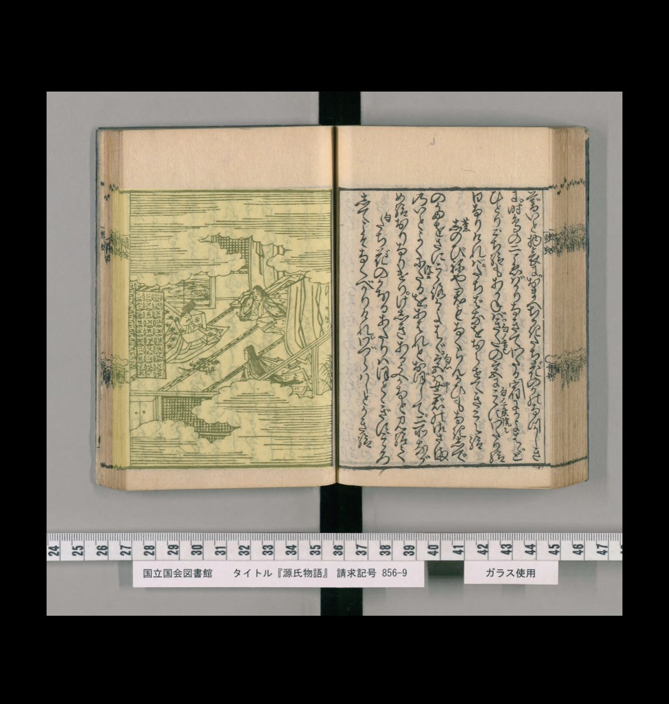

# Custom OpenSeaDragon Viewer

This is a custom openseadragon viewer.

## Install

```bash
npm install @nakamura196/osd-custom-viewer
```

## Usage

```js
import { OsdCustomViewer } from "@nakamura196/osd-custom-viewer";
import "@nakamura196/osd-custom-viewer/dist/style.css"

<OsdCustomViewer manifest="https://www.dl.ndl.go.jp/api/iiif/3437686/manifest.json"></OsdCustomViewer>
```

## Feature

### IIIF

`manifest`プロパティを与えることで、IIIF画像を表示できます。

### Emit

OpenSeaDragon側でのページ遷移を`@updated`で把握できます。

### Highlight

`regions`プロパティを与えることで、ハイライトが可能です。

